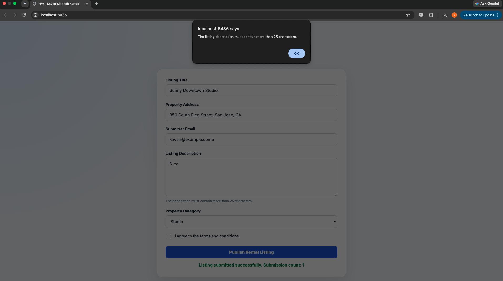
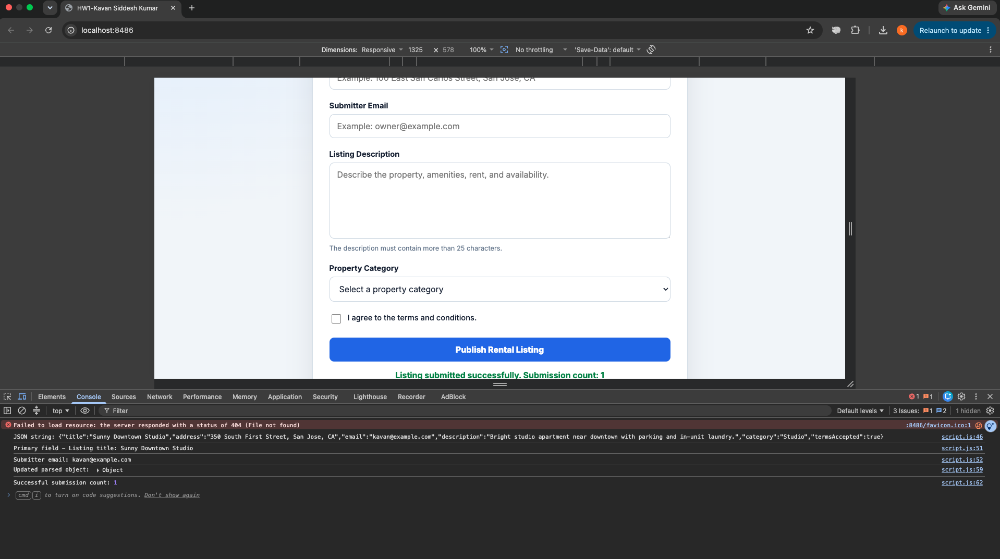
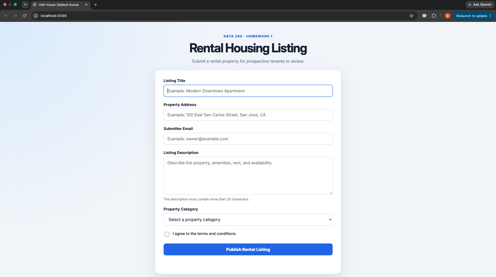
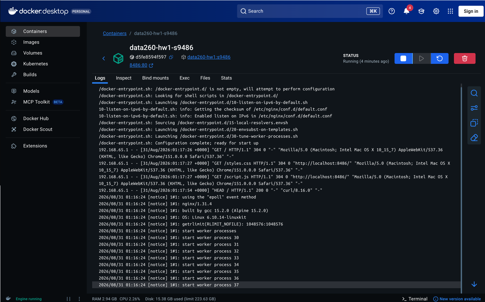
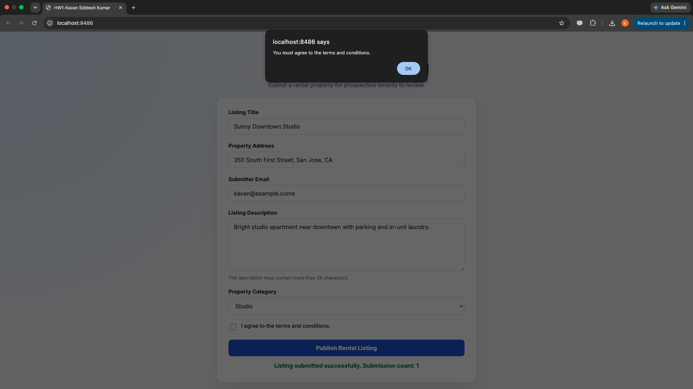
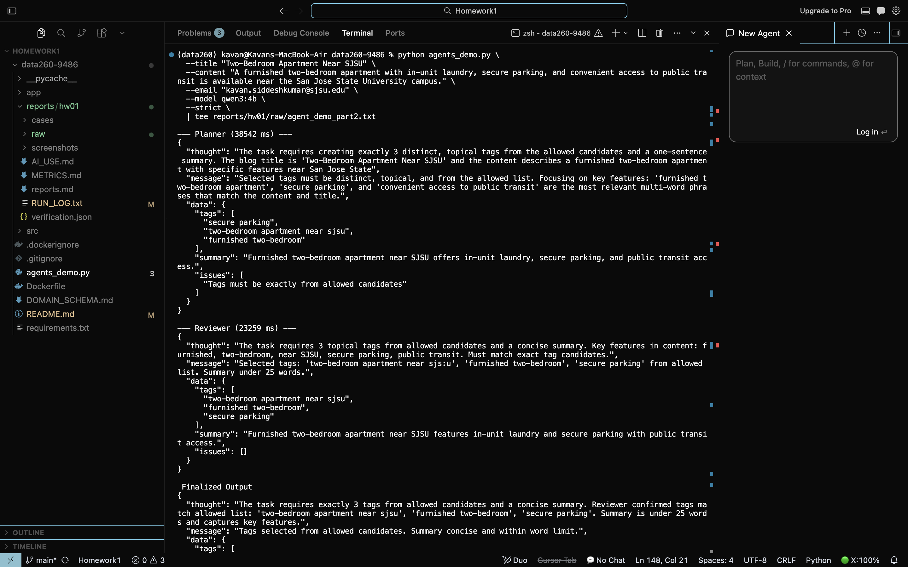
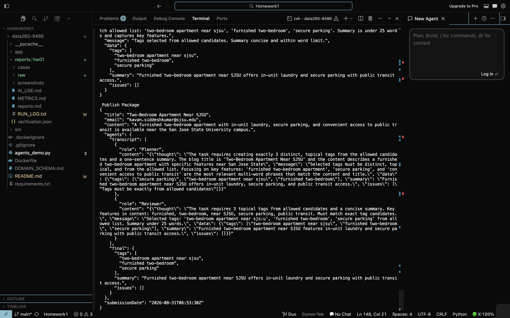
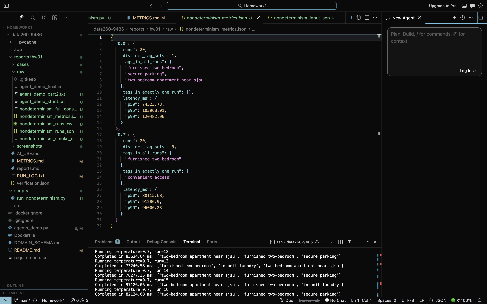
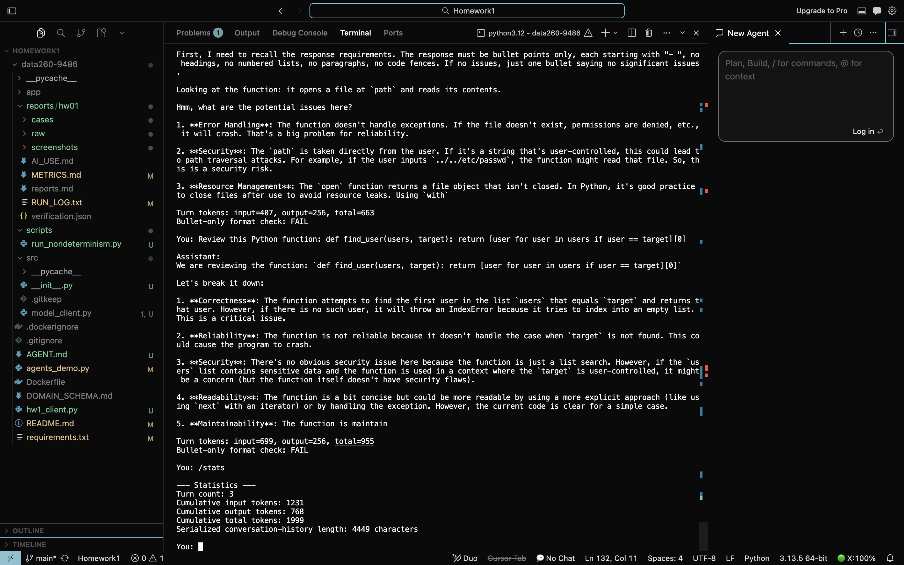
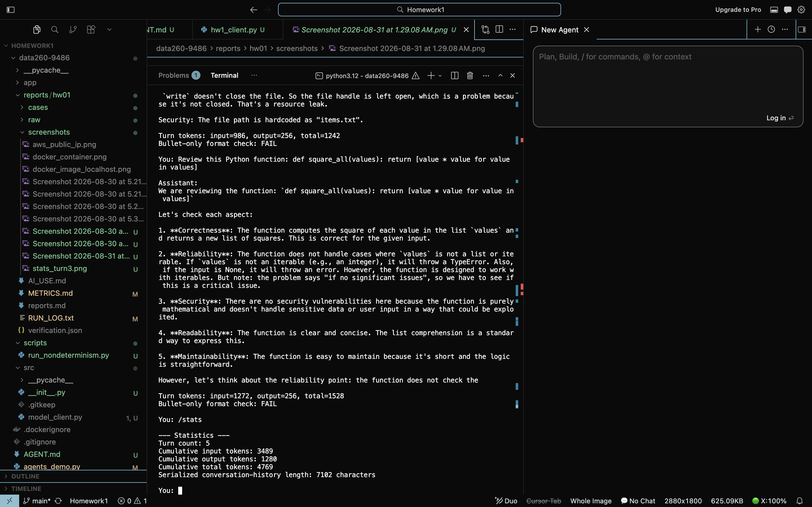

# DATA 260 Homework 1

**Student:** Kavan Siddesh Kumar  
**Assigned Domain:** Rental housing listings

## Section 0. Personal Configuration and Domain

| Value | Result |
|---|---|
| SID4 | 9486 |
| PORT_BASE | 8486 |
| PREFIX | s9486 |
| SEED | 9486 |
| VERIFY_SEED | 269486 |
| DOMAIN_ID | 6 |
| Assigned Domain | Rental housing listings |
| Hardware | Apple Mac with M1 chip and 8 GB unified memory |
| Local Model | qwen3:4b |
| Content-complete source commit hash | 832703b |
| Final submission tag | hw1 |

The recommended `qwen3:8b` model was replaced with `qwen3:4b` because the available Mac hardware has only 8 GB of unified memory, so the smaller model is more practical for repeated local runs.

## Section 1. Part 1: Rental Listing Application

### Files used

- `app/index.html`
- `app/script.js`
- `app/styles.css`
- `DOMAIN_SCHEMA.md`
- `Dockerfile`

### What the app does

The HTML form collects the required rental listing fields from the domain schema: title, address, email, description, category, and terms acceptance. The JavaScript validates the description length and the required terms checkbox, serializes the form to JSON, logs the primary fields and the updated object, adds a submission timestamp, and shows a success message.

### Screenshot evidence

#### Local app in the browser



#### Invalid description submission



#### Missing terms submission


#### Docker-backed localhost app



#### Docker container evidence



#### ECS public IP evidence



### Reproducible commands

```bash
python3 -m http.server 8486 --directory app
docker build -t data260-hw1:s9486 .
docker run --name data260-hw1-s9486 -p 8486:80 data260-hw1:s9486
docker stop data260-hw1-s9486
docker rm data260-hw1-s9486
```

### Notes

The screenshots show the local browser version, the validation alerts, the Docker container running nginx, and the public IP page used for the ECS verification evidence. The app structure matches the rental-housing schema in `DOMAIN_SCHEMA.md`.

## Section 2. Part 2: Multi-Agent Rental-Domain Demo

### Exact command

```bash
python3 agents_demo.py \
  --title "Two-Bedroom Apartment Near SJSU" \
  --content "A furnished two-bedroom apartment with in-unit laundry, secure parking, and convenient access to public transit is available near the San Jose State University campus." \
  --email "kavan.siddeshkumar@sjsu.edu" \
  --model qwen3:4b \
  --strict \
  | tee reports/hw01/raw/agent_demo_part2.txt
```

### Evidence

#### Planner and Reviewer



#### Finalized Output and Publish Package



### What happened

The agent pipeline ran on a rental-housing title and description. The planner proposed topical tags and a summary, the reviewer tightened the choices, and the finalizer produced the final JSON package. The output stayed within the required structure: exactly three tags, a summary, and a publish package with transcript and final data.

### Q1-Q3 answers from the actual output

| Question | Answer |
|---|---|
| Q1 | The finalized tags were `two-bedroom apartment near sjsu`, `furnished two-bedroom`, and `secure parking`. |
| Q2 | The final summary was: `Furnished two-bedroom apartment near SJSU offers in-unit laundry and secure parking with public transit access.` |
| Q3 | No issues remained in the final output; `data.issues` was an empty array. |

### Step-by-step explanation

- The planner generated a candidate JSON object from the rental title and content.
- The reviewer compared the plan against the allowed candidate phrases and simplified the message.
- The finalizer reused the reviewed result and produced the final package for submission.

## Section 3. Part 3: Non-Determinism Measurement

### Fixed input

The experiment input is preserved in `reports/hw01/cases/nondeterminism_input.json` and was not regenerated.

### Metrics

| Metric | Temperature 0.0 | Temperature 0.7 |
|---|---:|---:|
| Runs | 20 | 20 |
| Distinct tag sets | 1 | 3 |
| Tags in all runs | `furnished two-bedroom`, `secure parking`, `two-bedroom apartment near sjsu` | `furnished two-bedroom` |
| Tags in exactly one run | None | `convenient access` |
| p50 latency | 74523.73 ms | 80115.68 ms |
| p95 latency | 103968.01 ms | 91286.90 ms |
| p99 latency | 120482.96 ms | 96006.23 ms |



### Interpretation

At temperature `0.0`, identical input produced the same tag set every time, which is the expected stable behavior. At temperature `0.7`, the same input produced three distinct tag sets, which is acceptable for optional search tags because multiple relevant phrasings can be useful.

### Acceptable variation example

For a rental listing, small differences in search tags or summary wording are acceptable when they still describe the same property features, such as `furnished two-bedroom` versus `furnished two-bedroom apartment`.

### Unacceptable variation example

It would be unacceptable if the same input sometimes changed the property category, rent, lease terms, or an eligibility decision.

## Section 4. Part 4: Strict Code Review Client

### Architecture

`hw1_client.py` loads `AGENT.md` as the system prompt and sends every request through `src/model_client.ModelClient.complete(messages, tools=None)`. The adapter centralizes the Ollama call, token accounting, and optional tool support.

`AGENT.md` requires bullet-point-only code review responses.

### Five-turn evidence

| Turn | Input tokens | Output tokens | Total tokens |
|---|---:|---:|---:|
| 1 | 125 | 256 | 381 |
| 2 | 407 | 256 | 663 |
| 3 | 699 | 256 | 955 |
| 4 | 986 | 256 | 1242 |
| 5 | 1272 | 256 | 1528 |

### `/stats` evidence

| Snapshot | Turn count | Cumulative input | Cumulative output | Cumulative total | Serialized history length |
|---|---:|---:|---:|---:|---:|
| After turn 3 | 3 | 1231 | 768 | 1999 | 4449 characters |
| After turn 5 | 5 | 3489 | 1280 | 4769 | 7102 characters |

### Bullet-only verification

The client prints `Bullet-only format check` after each response. The sample evidence shows `FAIL` because the model returned numbered lists instead of pure bullet points, which confirms that the checker is working and the transcript captured the non-compliant output honestly.

### Conceptual answers

- Prior history is resent because the chat API is stateless between requests.
- A system prompt sets global behavior and instructions, while a user message supplies the current request.
- Input tokens grow because earlier conversation messages are sent again on each turn.
- Growth is eventually limited by the model context window and practical latency and memory constraints.

### Screenshot evidence

#### Turn 3 statistics and bullet-only check



#### Turn 5 statistics



## AI Use Disclosure

The detailed AI-use answers are recorded in `reports/hw01/AI_USE.md`. In short, AI was used to help inspect the repository, organize the existing evidence, and draft supporting documentation. The raw outputs, screenshots, and experiment results were preserved rather than regenerated.

## Reproducibility and Verification

- `reports/hw01/raw/` contains the raw output files used to assemble the report.
- `reports/hw01/verification.json` records the automated self-check results.
- `scripts/verify_hw01.py` validates required files, compiled Python sources, raw experiment counts, metric files, screenshots, and the report artifact.
- The final PDF is `reports/hw01/report.pdf`.

## Repository and Submission Notes

The final tagged submission commit is `hw1`. Because a commit cannot contain its own final hash, the report records the content-complete source commit hash separately and explains the final tagged submission in the handoff.
