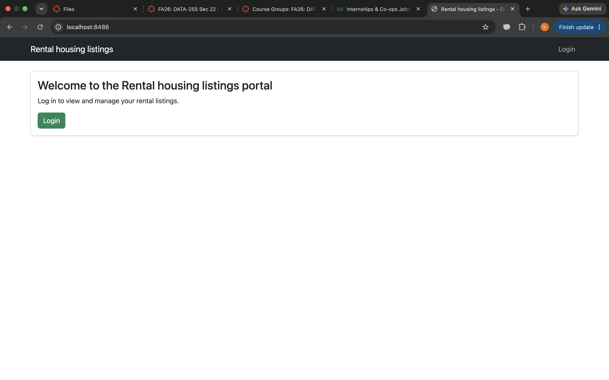
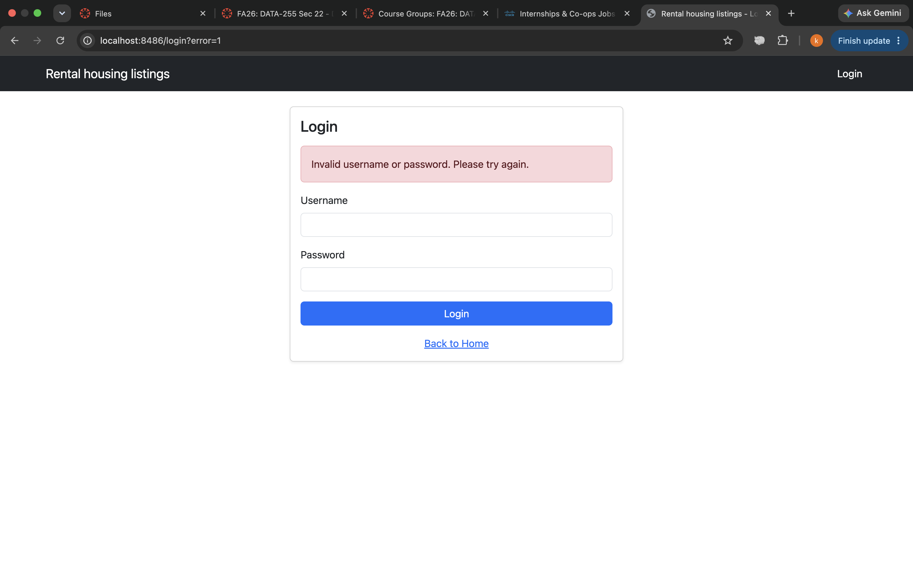
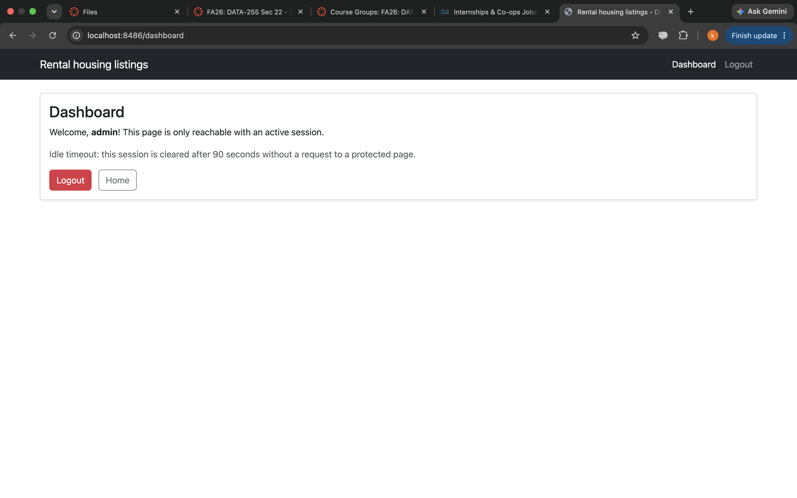
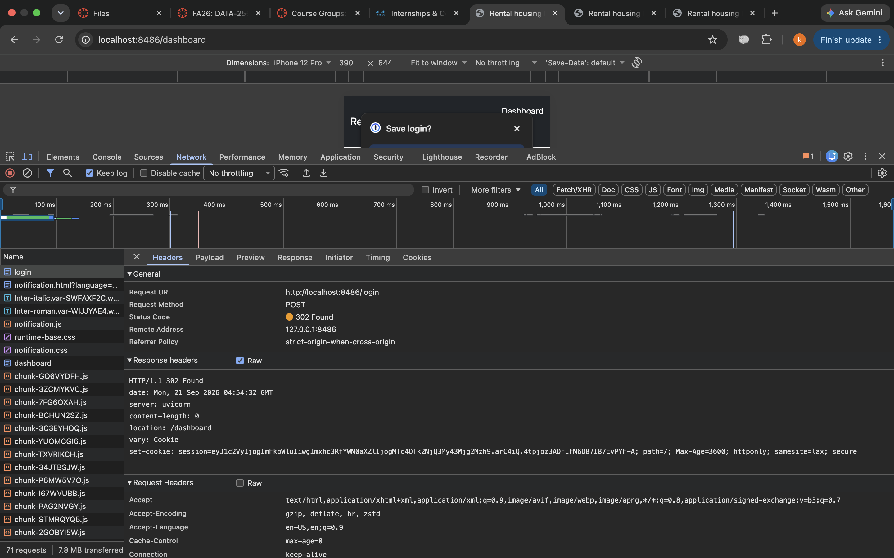
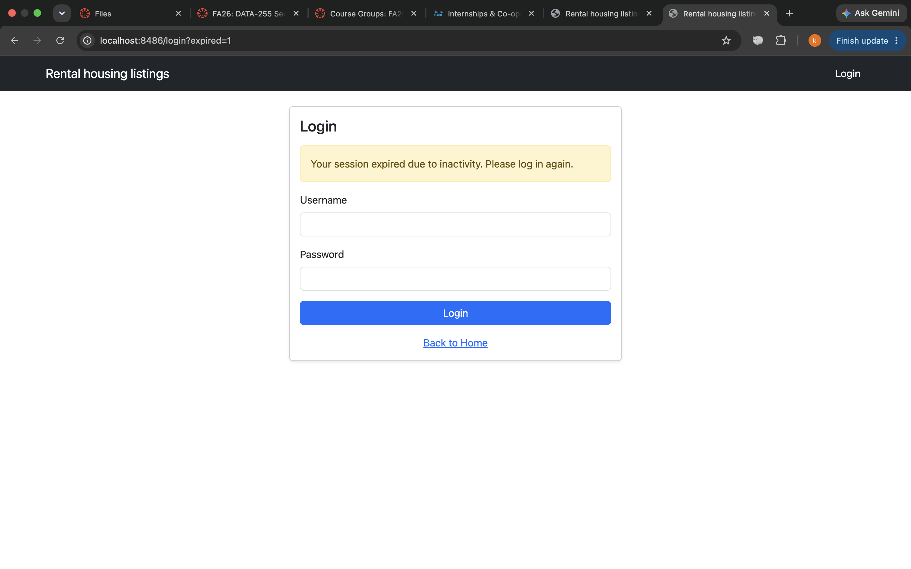
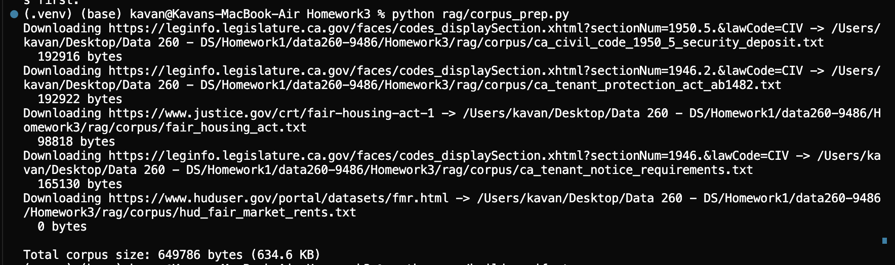
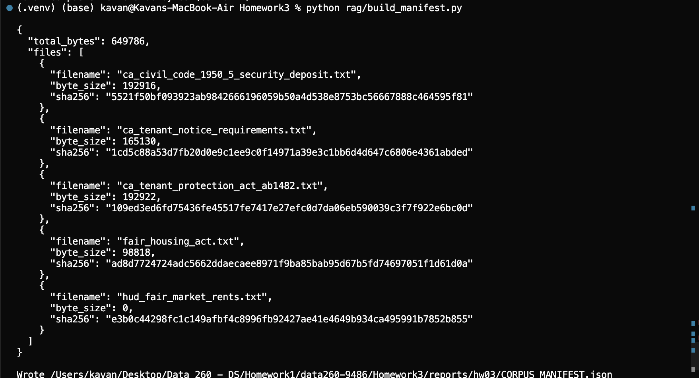
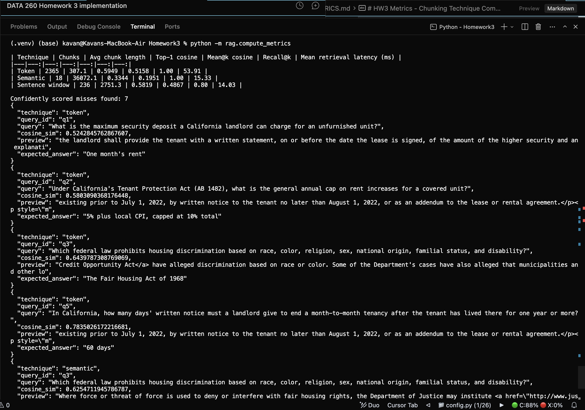
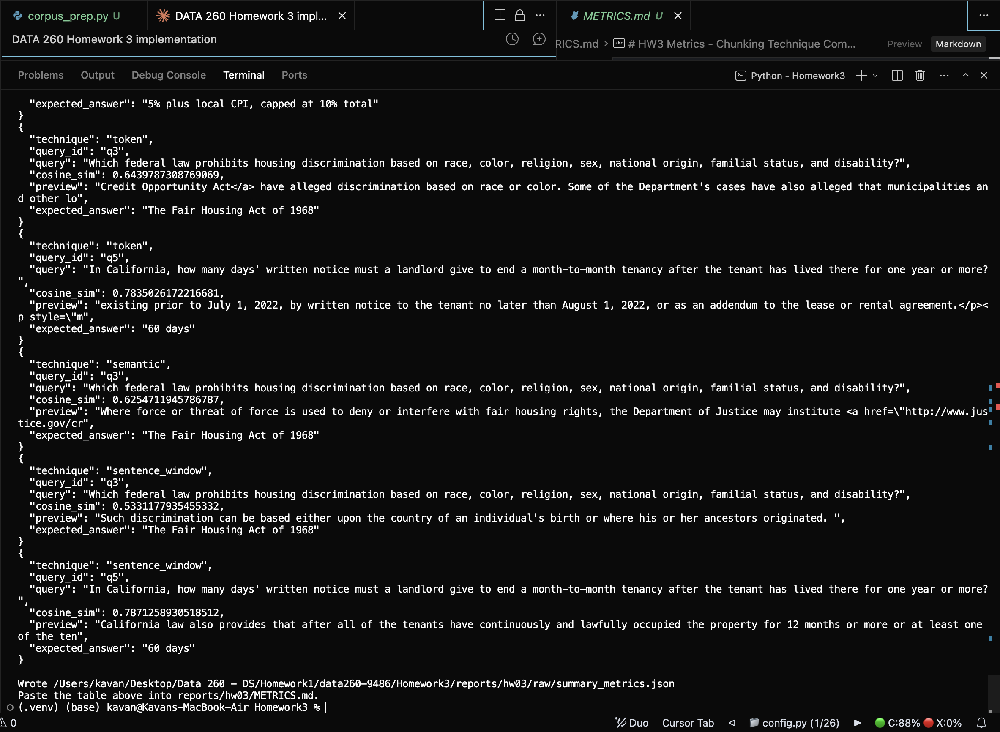

# DATA 260 - Homework 3

## Section 0. Personal Configuration and Domain

| Value | Configuration |
|---|---|
| SID4 | 9486 |
| PORT_BASE | 8486 |
| PREFIX | s9486 |
| SEED | 9486 |
| VERIFY_SEED | 269486 |
| DOMAIN_ID | 6 |
| Assigned Domain | Rental housing listings |
| Hardware | Apple MacBook Air with Apple M1 chip and 8 GB unified memory |
| Local model | Not applicable - Part 2 uses the sentence-transformers/all-MiniLM-L6-v2 embedding model (Hugging Face); no local LLM was required for this homework |
| Tagged commit hash (`git rev-parse HEAD` after tagging `hw3`) | TODO_RUN_MANUALLY |
| GitHub repository | https://github.com/Kavan1804/data260-9486 (confirm Sbnikitha and supriyaselvanganesan have access) |

The six configuration values above are computed in `config.py` and were
carried over unchanged from `Homework1/README.md`, since the assignment
specifies they "stay fixed for the rest of the semester."

### Reproducible run instructions

```bash
cd Homework3
python3 -m venv .venv && source .venv/bin/activate
pip install -r requirements.txt

# Part 1: auth app
python3 main.py
# open http://localhost:8486/

# Part 2: retrieval experiments
python rag/corpus_prep.py
python rag/build_manifest.py
python -m rag.run_experiments
python -m rag.compute_metrics

# Self-check
COMMIT_HASH=$(git rev-parse HEAD) python3 scripts/verify_hw03.py
```

## Part 1. Authentication App

### Routes

- `GET /` - domain welcome message, login link or dashboard/logout links depending on session state.
- `GET /login` / `POST /login` - login form; invalid credentials show a Bootstrap alert.
- `GET /dashboard` - protected; requires an active, non-idle session.
- `GET /logout` - clears the session and redirects home.



*GET / while logged out - Login link shown in navbar, welcome card with a Login button.*

[SCREENSHOT PLACEHOLDER: GET / while logged in - still needed. Log in, then screenshot the home page, which should show "You are logged in as admin" plus Dashboard/Logout buttons.]



*Submitting the wrong password redirects to `/login?error=1`, which renders the red Bootstrap alert "Invalid username or password. Please try again."*



*Dashboard after logging in as `admin`: welcome message, idle-timeout note, Logout/Home buttons.*

[SCREENSHOT PLACEHOLDER: GET /logout redirecting back to / logged out - still needed. Click Logout from the dashboard and screenshot the resulting home page (should look like the logged-out home screenshot above, reached via the logout redirect).]

[SCREENSHOT PLACEHOLDER: templates/ directory listing (index.html, login.html, dashboard.html) - still needed. A Finder/VS Code sidebar screenshot of Homework3/templates/ is enough.]

### Session cookie evidence (Secure, HttpOnly, SameSite)



Captured from Chrome DevTools -> Network -> the `POST /login` request (the
one that returns `302 Found` with `location: /dashboard`), Response Headers:

```text
set-cookie: session=<signed session value>; path=/; Max-Age=3600; httponly; samesite=lax; secure
```

All three required attributes are present: `Secure`, `HttpOnly`
(`httponly`), and `SameSite` (`samesite=lax`). This works over plain
`http://localhost:8486` because Chrome treats `http://localhost` as a secure
context and still sends `Secure` cookies to it; Safari and Firefox do not
make that exception, so a self-signed HTTPS server
(`--ssl-keyfile`/`--ssl-certfile`) would be needed to verify this there.

### Idle timeout and logged-out session verification

`IDLE_TIMEOUT_SECONDS` in `config.py` is set to 90 seconds for easy manual
testing.



*After logging in and then waiting more than 90 seconds without visiting a
protected route, requesting `/dashboard` again redirects to
`/login?expired=1`, which shows the yellow "Your session expired due to
inactivity" alert - proving the idle session could not reach `/dashboard`.*

[SCREENSHOT PLACEHOLDER: /dashboard redirecting to /login after logout (not idle-timeout) - still needed. Log in, click Logout, then request /dashboard directly to show the cleared session is also rejected, distinct from the idle-timeout case above.]

### auth.py

The full router implementation, as required by the assignment ("Include
only the auth.py code at the bottom"):

```python
import time
from typing import Optional

from fastapi import APIRouter, Form, Request
from fastapi.responses import RedirectResponse
from fastapi.templating import Jinja2Templates
from starlette.status import HTTP_302_FOUND

from config import DOMAIN_NAME, IDLE_TIMEOUT_SECONDS

# Behaves like a mini FastAPI app; wired into main.py with app.include_router()
router = APIRouter()

templates = Jinja2Templates(directory="templates")

# Hardcoded credentials for local manual verification only.
# A real deployment would check a user database with hashed passwords.
VALID_USERNAME = "admin"
VALID_PASSWORD = "password"


def _session_status(request: Request):
    """Return ("active", user), ("expired", None), or ("none", None).

    Idle timeout is not something Starlette's SessionMiddleware tracks on its
    own (max_age is a fixed cookie lifetime, not an idle window), so the last
    active time is stored inside the session and checked on every request to
    a protected route.
    """
    user = request.session.get("user")
    if not user:
        return "none", None

    last_active = request.session.get("last_active")
    if last_active is None or time.time() - last_active > IDLE_TIMEOUT_SECONDS:
        request.session.clear()
        return "expired", None

    request.session["last_active"] = time.time()  # sliding idle window
    return "active", user


@router.get("/")
def home(request: Request):
    _, user = _session_status(request)
    return templates.TemplateResponse(
        request,
        "index.html",
        {"user": user, "domain_name": DOMAIN_NAME},
    )


@router.get("/login")
def login_page(request: Request, error: Optional[str] = None, expired: Optional[str] = None):
    return templates.TemplateResponse(
        request,
        "login.html",
        {
            "domain_name": DOMAIN_NAME,
            "show_invalid_alert": error == "1",
            "show_expired_alert": expired == "1",
        },
    )


@router.post("/login")
def login(request: Request, username: str = Form(...), password: str = Form(...)):
    if username == VALID_USERNAME and password == VALID_PASSWORD:
        request.session["user"] = username
        request.session["last_active"] = time.time()
        return RedirectResponse(url="/dashboard", status_code=HTTP_302_FOUND)

    # Invalid credentials: redirect back with a flag the template turns into
    # a Bootstrap alert, instead of silently reloading the empty form.
    return RedirectResponse(url="/login?error=1", status_code=HTTP_302_FOUND)


@router.get("/dashboard")
def dashboard(request: Request):
    status, user = _session_status(request)

    if status == "expired":
        return RedirectResponse(url="/login?expired=1", status_code=HTTP_302_FOUND)
    if status == "none":
        return RedirectResponse(url="/login", status_code=HTTP_302_FOUND)

    return templates.TemplateResponse(
        request,
        "dashboard.html",
        {
            "user": user,
            "domain_name": DOMAIN_NAME,
            "idle_timeout": IDLE_TIMEOUT_SECONDS,
        },
    )


@router.get("/logout")
def logout(request: Request):
    request.session.clear()
    return RedirectResponse(url="/", status_code=HTTP_302_FOUND)
```

## Part 2. Retrieval-Only RAG - Three Chunking Techniques

Corpus: 5 public California/federal rental-housing law documents totaling
649,786 bytes (see `SOURCES.md` and `CORPUS_MANIFEST.json`). Note:
`hud_fair_market_rents.txt` downloaded as 0 bytes (a broken source URL) -
see the caveat in `METRICS.md`; the numbers below reflect the corpus as
actually downloaded, including that gap.



*`python rag/corpus_prep.py` downloading the four working sources plus the
broken 0-byte HUD file.*



*`python rag/build_manifest.py` computing real byte sizes and SHA-256
hashes into `CORPUS_MANIFEST.json`.*

### Code snippets

**Token-based chunking (`TokenTextSplitter`)**

```python
from rag.pipelines import build_nodes, build_index, retrieve_and_score, load_corpus, get_embed_model

embed_model = get_embed_model()
documents = load_corpus("rag/corpus")
nodes = build_nodes(documents, "token", embed_model=embed_model)
index = build_index(nodes, embed_model=embed_model)
rows, latency_ms = retrieve_and_score(index, "token", "<one of the five questions>", k=5, embed_model=embed_model)
```

Output per query: the query embedding dimension (384 for
`all-MiniLM-L6-v2`) and its first 8 values, the query-vector and stacked
doc-vectors shapes, then a `rank | store_score | cosine_sim | chunk_len |
preview` line per retrieved node - written to `raw/token.jsonl`.

**Semantic chunking (`SemanticSplitterNodeParser`)**

```python
nodes = build_nodes(documents, "semantic", embed_model=embed_model)
index = build_index(nodes, embed_model=embed_model)
rows, latency_ms = retrieve_and_score(index, "semantic", "<same question>", k=5, embed_model=embed_model)
```

Written to `raw/semantic.jsonl`.

**Sentence-window chunking (`SentenceWindowNodeParser`)**

```python
nodes = build_nodes(documents, "sentence_window", embed_model=embed_model)
index = build_index(nodes, embed_model=embed_model)
rows, latency_ms = retrieve_and_score(index, "sentence_window", "<same question>", k=5, embed_model=embed_model)
```

Written to `raw/sentence_window.jsonl`.





*`python -m rag.compute_metrics` reading `raw/token.jsonl`, `raw/semantic.jsonl`,
and `raw/sentence_window.jsonl`, printing the summary table above and all 7
confidently scored misses, then writing `raw/summary_metrics.json`.*

### Retrieval quality comparison

| Technique | Chunks | Avg chunk length | Top-1 cosine | Mean@k cosine | Recall@k | Mean retrieval latency (ms) |
|---|---:|---:|---:|---:|---:|---:|
| Token | 2365 | 307.1 | 0.5949 | 0.5158 | 1.00 | 53.91 |
| Semantic | 18 | 36072.1 | 0.3344 | 0.1951 | 1.00 | 15.33 |
| Sentence window | 236 | 2751.3 | 0.5819 | 0.4867 | 0.80 | 14.03 |

(Source: `raw/summary_metrics.json`, computed by `rag/compute_metrics.py`
from `raw/token.jsonl`, `raw/semantic.jsonl`, `raw/sentence_window.jsonl`.)

### Confidently scored miss

**Technique:** Token | **Query (q3):** "Which federal law prohibits housing
discrimination based on race, color, religion, sex, national origin,
familial status, and disability?" | **Expected answer:** "The Fair Housing
Act of 1968" | **Cosine similarity:** 0.6440

**Retrieved chunk preview:** "Credit Opportunity Act</a> have alleged
discrimination based on race or color. Some of the Department's cases have
also alleged that municipalities and other lo..."

**Why the embedding likely scored this high:** the chunk comes from the
same DOJ Fair Housing Act page but discusses a related law (the Equal
Credit Opportunity Act) in a passage about race/color discrimination
claims. It shares heavy topical and lexical overlap with the query
(discrimination, race, color, federal enforcement) without naming the Fair
Housing Act itself, so the embedding model scores it as similar based on
shared vocabulary and subject matter rather than shared facts. Six more
confident misses with the same pattern are listed in
`raw/summary_metrics.json`.

### Observations

Token chunking had the best retrieval quality (top-1 cosine 0.595, mean@k
0.516) and full recall on this corpus, but at the highest cost: fixed
256-token chunks produced 2365 nodes, so its brute-force similarity search
took ~54ms per query versus ~14-15ms for the other two techniques, which
index far fewer, larger nodes. Semantic chunking was the outlier: with
`buffer_size=1` and a 95th-percentile breakpoint threshold, it found very
few semantic boundaries in this statutory text and produced only 18 chunks
averaging over 36,000 characters each - essentially whole-document chunks
that dilute the specific passage a query is looking for, which explains its
much lower top-1 (0.334) and mean@k (0.195) cosine despite still landing
the right document in the top-k. Sentence-window chunking sat between the
two on similarity (top-1 0.582) but missed one question's expected source
entirely (recall@k 0.80), which is consistent with a single sentence-plus-
window sometimes carrying too little surrounding context to outscore a
topically-adjacent sentence elsewhere in the corpus.

### Conclusion

For this corpus, token-based chunking is the best choice: it had the
highest top-1 and mean@k cosine and the only perfect recall@k among the
three techniques, and its ~40ms latency cost over the other methods is
negligible for a five-document, retrieval-only corpus. Semantic chunking's
default parameters under-split this legal/statutory text badly (18 chunks
for 650KB), and would need a lower breakpoint percentile or smaller buffer
size to be competitive. Sentence-window chunking is a reasonable middle
ground if per-chunk context matters more than raw similarity, but its
recall gap here means it should not be the default without further tuning.

## AI Use

See `AI_USE.md` for the four required AI-use questions.
